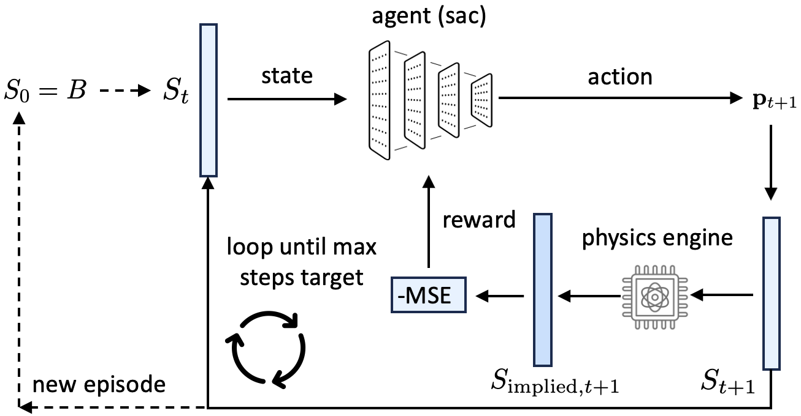

This project presents a novel reinforcement learning (RL) approach for solving the classical 2-level atom non-Local Thermodynamic Equilibrium (non-LTE) radiative transfer problem.
The core idea is to frame the problem as a control task where an RL agent learns a policy to determine a depth-dependent source function, $S(\tau)$, that self-consistently satisfies the equation of statistical equilibrium (SE). The agent's policy is optimized entirely via reward-based interactions with a radiative transfer engine, without explicit knowledge of the ground truth solution. The agent is implemented using the Soft Actor-Critic (SAC) algorithm from the Stable Baselines3 library and the forward transfer model is adapted from the publicly available two-level Non-LTE code by Ivan Milić, which can be found at https://github.com/ivanzmilic/2lvl_nlte.git. 

  

